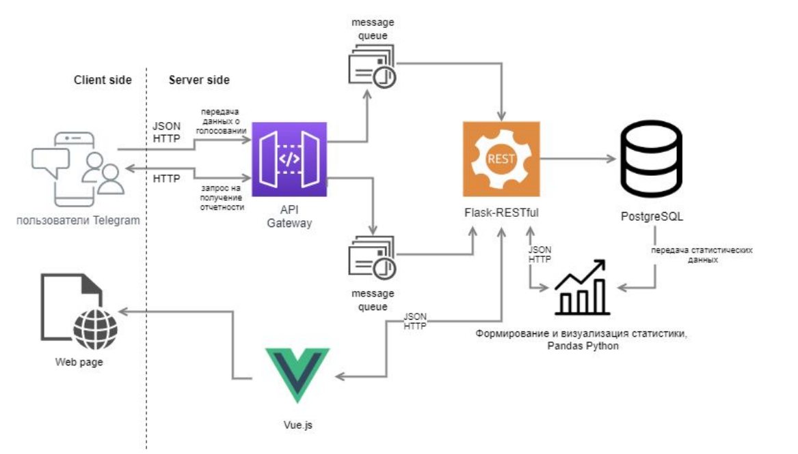
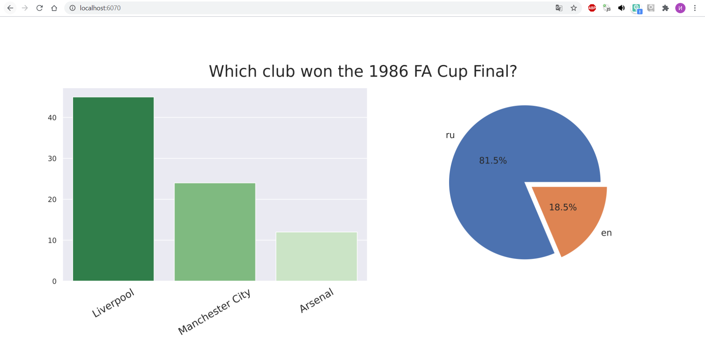

# High Loaded Poll Service.

High Loaded Poll Service is a service for realtime poll analysis and visualisation.
It represents a set of 5 microservices:
    
* **Bot** - getting messages from users through Telegram bot; 
* **Distributor** - Data manipulator;
* **DB** - PostgreSQL database;
* **Analyzer** - Data analyse microservice;
* **Web** - Web page to show results;



## Installation

To start the service run:

```bash
git clone https://github.com/IgorHoholko/high_loaded_poll_service
cd high_loaded_poll_service
set TOKEN=<Bot Token>
docker-compose up build
```

Migrate database.


## Overview 

Result analytic you can see at http://localhost:6070/



Database distributor is located at http://localhost:6060/


